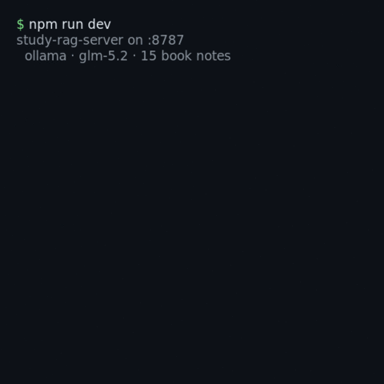

# study-rag-server

<div align="center">
  
</div>

> **Part of the Study Framework** — the "ask your vault" piece. The other components
> (speed-reading, spaced-repetition, quiz, and `claude-study-server` for generation) turn a single
> note into study material. This one lets you **ask questions across your whole Obsidian vault** and
> get answers grounded ONLY in your notes, with citations back to the source note.

A self-hosted RAG (retrieval-augmented generation) backend. **Open models only** — it talks to
whatever local LLM server you run (llama.cpp, Ollama, LM Studio, vLLM) through the OpenAI-compatible
API. No API keys, no vendor lock-in.

## Design: nothing tied to a single model or store

The LLM backend keeps changing (Claude SDK → Ollama → llama.cpp...). So the logic does **not** know
any concrete provider: it programs against two interfaces, and every backend is a thin adapter.

- **`LLMProvider`** (`src/llm/provider.ts`): `chat()` + `embed()`. The `openai-compat` adapter covers
  llama.cpp / Ollama / LM Studio / vLLM. **Switching model or origin = edit `LLM_BASE_URL` /
  `LLM_MODEL` in `.env`. Zero code.** A non-compatible backend = one new adapter implementing the
  interface.
- **`VectorStore`** (`src/store/vector-store.ts`): `upsert()` + `search()`. Adapters: `memory`
  (zero-infra, for dev/tests) and `pgvector` (Postgres, production).

The RAG logic (chunking, similarity, grounded prompt) is **pure and unit-tested** (`src/rag/*.ts`,
tests with `node:test`). The I/O (HTTP, fs, DB) is thin and holds no business logic.

## Quickstart

```bash
pnpm install
cp .env.example .env            # point VAULT_PATH to your notes and LLM_BASE_URL to your local server
pnpm test                       # run the pure-logic tests
pnpm dev                        # start the server (or: pnpm build && pnpm start)

curl -X POST localhost:8787/api/index                              # index the vault
curl -X POST localhost:8787/api/ask -H 'content-type: application/json' \
     -d '{"question":"What do my notes say about retrieval practice?"}'
```

## Endpoints

| Method | Path | What it does |
|---|---|---|
| `GET`  | `/health`    | status (which LLM and store are behind it) |
| `POST` | `/api/index` | chunk the vault, embed it, store it |
| `POST` | `/api/ask`   | `{ question }` → `{ answer, sources[] }` with citations to your notes |

## Running with different models (no code changes)

```
# Ollama (one server does chat and embeddings)
LLM_BASE_URL=http://127.0.0.1:11434  LLM_MODEL=llama3.1  LLM_EMBED_MODEL=nomic-embed-text

# llama.cpp (a server does chat OR embeddings, not both) -> split the endpoints:
LLM_BASE_URL=http://127.0.0.1:8080         # chat
LLM_EMBED_BASE_URL=http://127.0.0.1:11434  # embeddings (another llama.cpp --embedding, or Ollama)
```

`LLM_EMBED_BASE_URL` defaults to `LLM_BASE_URL` when unset.

## Structure

```
src/
  llm/     provider.ts (interface) · openai-compat.ts (adapter) · index.ts (factory)
  store/   vector-store.ts (interface) · memory-store.ts · pgvector-store.ts · index.ts
  rag/     chunk.ts · similarity.ts · prompt.ts  (+ *.test.ts, pure logic)
  index-vault.ts · ask.ts · server.ts · main.ts   (I/O and wiring)
```
